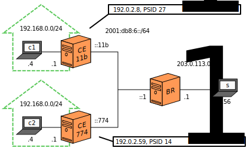
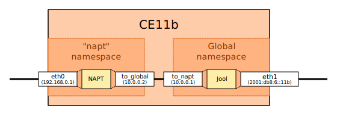
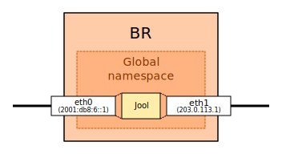

# MAP-T Run

## Index

1. [Introduction](#introduction)
2. [Sample Network](#sample-network)
3. [Configuration](#configuration)
	1. [Networking: CEs](#networking-ces)
	2. [Networking: BR](#networking-br)
	3. [NAPT](#napt)
	4. [Jool: CEs](#jool-ces)
	5. [Jool: BR](#jool-br)
4. [Testing](#testing)
5. [Stopping Jool](#stopping-jool)
6. [Afterwords](#afterwords)

## Introduction

This document explains how to run Jool in [MAP-T mode](intro-xlat.html#map-t).

>  MAP-T support will come out in Jool 4.2. (The latest official release is version 4.1.4.) If you want to follow this tutorial, use the code from the [mapt](https://github.com/NICMx/Jool/tree/mapt) branch.

## Sample Network


This network was explained in the [MAP-T summary](map-t.html).

To prevent this tutorial from dragging on, we'll reduce that mess to a couple of random CEs:



## Configuration

### Networking: Clients

<div class="distro-menu">
	<span class="distro-selector" onclick="showDistro(this);">c1</span>
	<span class="distro-selector" onclick="showDistro(this);">c2</span>
</div>

```bash
user@c1:~# /sbin/ip address add 192.168.0.4/24 dev eth0
user@c1:~# /sbin/ip link set eth0 up
user@c1:~# /sbin/ip route add default via 192.168.0.1
```

```bash
user@c2:~# /sbin/ip address add 192.168.0.4/24 dev eth0
user@c2:~# /sbin/ip link set eth0 up
user@c2:~# /sbin/ip route add default via 192.168.0.1
```

### Networking: Sample Server

As usual, `s` is supposed to represent a random Internet server, but for the sake of completeness, we'll cheese the routing for the sake of a self-sufficient tutorial:

```bash
user@s:~# /sbin/ip address add 203.0.113.56/24 dev eth0
user@s:~# /sbin/ip link set eth0 up
user@s:~# /sbin/ip route add 192.0.2.0/24 via 203.0.113.1
```

### Networking: CEs

Because of technical difficulties that have to do with the architecture of the Linux network stack, each CE needs to consist of two separate network namespaces; one for the NAPT, and one for the translator.

> Why? The Linux kernel wasn't really designed with MAP-T in mind. In fact, it wasn't exactly friendly with SIIT and NAT64 either, but [we dealt with that](intro-jool.html#design). MAP-T has an additional significant problem in that the CE translation wants to happen during PREROUTING, but NAPT happens during POSTROUTING. And, per the [packet flow example](map-t.html#ce-behavior), the CE has to translate **after** NAPT.
> 
> At the moment, that appears to be an unsolvable problem.

If you don't know how to work with network namespaces, [here's an introduction](TODO).

Suppose CE11b's household-facing interface is `eth0`, and its ISP-facing interface is called `eth1`. Here's a visual representation of what we want to achieve:



>  The (private) `10.0.0` network is only used to connect the namespaces. It is going to be completely invisible outside of the CE.

We're going to postpone the "NAPT" and "Jool" boxes, but aside from that, this is one way to assemble the diagram:

<div class="distro-menu">
	<span class="distro-selector" onclick="showDistro(this);">CE 11b</span>
	<span class="distro-selector" onclick="showDistro(this);">CE 774</span>
</div>

```bash
user@CE11b:~# # Create the new namespace
user@CE11b:~# /sbin/ip netns add napt
user@CE11b:~#
user@CE11b:~# # Connect the two namespaces through veth pair interfaces
user@CE11b:~# /sbin/ip link add to_napt type veth peer name to_global netns napt
user@CE11b:~#
user@CE11b:~# # Send the physical eth0 interface to the new namespace
user@CE11b:~# /sbin/ip link set eth0 netns napt
user@CE11b:~#
user@CE11b:~# # Assign addresses to each interface
user@CE11b:~# /sbin/ip address add 2001:db8:6::11b/64 dev eth1
user@CE11b:~# /sbin/ip address add 10.0.0.1/24 dev to_napt
user@CE11b:~# /sbin/ip netns exec napt /sbin/ip address add 10.0.0.2/24 dev to_global
user@CE11b:~# /sbin/ip netns exec napt /sbin/ip address add 192.168.0.1/24 dev eth0
user@CE11b:~#
user@CE11b:~# # Activate all interfaces
user@CE11b:~# /sbin/ip link set eth1 up
user@CE11b:~# /sbin/ip link set to_napt up
user@CE11b:~# /sbin/ip netns exec napt /sbin/ip link set to_global up
user@CE11b:~# /sbin/ip netns exec napt /sbin/ip link set eth0 up
user@CE11b:~#
user@CE11b:~# # Add essential routes to both namespaces
user@CE11b:~# /sbin/ip netns exec napt /sbin/ip route add default via 10.0.0.1
user@CE11b:~# /sbin/ip route add 64:ff9b::/96 via 2001:db8:6::1
user@CE11b:~# /sbin/ip route add 192.0.2.8/32 via 10.0.0.2
user@CE11b:~#
user@CE11b:~# # Turn both namespaces into routers
user@CE11b:~# /sbin/ip netns exec napt /sbin/sysctl -w net.ipv4.conf.all.forwarding=1
user@CE11b:~# /sbin/sysctl -w net.ipv4.conf.all.forwarding=1
user@CE11b:~# /sbin/sysctl -w net.ipv6.conf.all.forwarding=1
```

```bash
user@CE774:~# # Create the new namespace
user@CE774:~# /sbin/ip netns add napt
user@CE774:~#
user@CE774:~# # Connect the two namespaces through veth pair interfaces
user@CE774:~# /sbin/ip link add to_napt type veth peer name to_global netns napt
user@CE774:~#
user@CE774:~# # Send the physical eth0 interface to the new namespace
user@CE774:~# /sbin/ip link set eth0 netns napt
user@CE774:~#
user@CE774:~# # Assign addresses to each interface
user@CE774:~# /sbin/ip address add 2001:db8:6::774/64 dev eth1
user@CE774:~# /sbin/ip address add 10.0.0.1/24 dev to_napt
user@CE774:~# /sbin/ip netns exec napt /sbin/ip address add 10.0.0.2/24 dev to_global
user@CE774:~# /sbin/ip netns exec napt /sbin/ip address add 192.168.0.1/24 dev eth0
user@CE774:~#
user@CE774:~# # Activate all interfaces
user@CE774:~# /sbin/ip link set eth1 up
user@CE774:~# /sbin/ip link set to_napt up
user@CE774:~# /sbin/ip netns exec napt /sbin/ip link set to_global up
user@CE774:~# /sbin/ip netns exec napt /sbin/ip link set eth0 up
user@CE774:~#
user@CE774:~# # Add essential routes to both namespaces
user@CE774:~# /sbin/ip netns exec napt /sbin/ip route add default via 10.0.0.1
user@CE774:~# /sbin/ip route add 64:ff9b::/96 via 2001:db8:6::1
user@CE774:~# /sbin/ip route add 192.0.2.59/32 via 10.0.0.2
user@CE774:~#
user@CE774:~# # Turn both namespaces into routers
user@CE774:~# /sbin/ip netns exec napt /sbin/sysctl -w net.ipv4.conf.all.forwarding=1
user@CE774:~# /sbin/sysctl -w net.ipv4.conf.all.forwarding=1
user@CE774:~# /sbin/sysctl -w net.ipv6.conf.all.forwarding=1
```

### Networking: BR



```bash
user@BR:~# /sbin/ip link set eth0 up
user@BR:~# /sbin/ip address add 2001:db8:6::1/64 dev eth0
user@BR:~#
user@BR:~# /sbin/ip link set eth1 up
user@BR:~# /sbin/ip address add 203.0.113.1/24 dev eth1
user@BR:~#
user@BR:~# /sbin/ip route add 2001:db8:ce:11b::/64 via 2001:db8:6::11b
user@BR:~# /sbin/ip route add 2001:db8:ce:774::/64 via 2001:db8:6::774
user@BR:~#
user@BR:~# /sbin/sysctl -w net.ipv4.conf.all.forwarding=1
user@BR:~# /sbin/sysctl -w net.ipv6.conf.all.forwarding=1
```

Again, the "Jool" box is not yet prepared, but by now the CE and BR should be able to ping any neighbors you want to set up.

### NAPT

In the Linux kernel, NAPT is known as SNAT/DNAT. Only the SNAT half is relevant for our current purposes. You can find a description of the SNAT target (as well as its `--to-source` argument) in the [iptables(8)](https://linux.die.net/man/8/iptables#snat) man page.

<div class="distro-menu">
	<span class="distro-selector" onclick="showDistro(this);">CE 11b</span>
	<span class="distro-selector" onclick="showDistro(this);">CE 774</span>
</div>

```bash
user@CE11b:~# /sbin/ip netns exec napt iptables \
			-t nat -A POSTROUTING \
			-s 192.168.0.0/24 -o to_global -p tcp \
			-j SNAT --to-source 192.0.2.8:55296-57343
user@CE11b:~# /sbin/ip netns exec napt iptables \
			-t nat -A POSTROUTING \
			-s 192.168.0.0/24 -o to_global -p udp \
			-j SNAT --to-source 192.0.2.8:55296-57343
```

```bash
user@CE774:~# /sbin/ip netns exec napt iptables \
			-t nat -A POSTROUTING \
			-s 192.168.0.0/24 -o to_global -p tcp \
			-j SNAT --to-source 192.0.2.59:28672-30719
user@CE774:~# /sbin/ip netns exec napt iptables \
			-t nat -A POSTROUTING \
			-s 192.168.0.0/24 -o to_global -p udp \
			-j SNAT --to-source 192.0.2.59:28672-30719
```

The commands above "funnel" the private (`192.168.0`) network into the CE's assigned port range (`192.0.2.XXX:XXXXX-XXXXX`).

Some observations:

1. If you want to use the nftables NAT instead, go ahead. The napt namespace and the global namespace are independent boxes, so Jool doesn't care which NAT implementation you use, as long as it funnels the entirety of the private network into the CE's assigned port range.
2. You might have noticed that the command variants above are missing ICMP rules. This is because the iptables NAT is seemingly incapable of funneling the ICMP equivalent of port numbers (ICMP identifiers). There is not much I can do about this until Jool is formally merged into nftables. (Which is going to be 2021 work.) Pings will not work for now.
3. Since we're only funneling the `192.160.0` network, the `napt` namespace's own traffic (sourced `10.0.0.2`) will not be translated by Jool. This in turn means that `napt` will not have Internet access, even though its clients will. I'm at peace with this, particularly since `napt` is just a subset of the CE where traffic doesn't normally originate.

### Jool: CEs

<div class="distro-menu">
	<span class="distro-selector" onclick="showDistro(this);">CE 11b</span>
	<span class="distro-selector" onclick="showDistro(this);">CE 774</span>
</div>

```bash
user@CE11b:~# /sbin/modprobe jool_mapt
user@CE11b:~# jool_mapt instance add "CE 11b" --netfilter --dmr 64:ff9b::/96
user@CE11b:~# jool_mapt -i "CE 11b" global update end-user-ipv6-prefix 2001:db8:ce:11b::/64
user@CE11b:~# jool_mapt -i "CE 11b" global update bmr 2001:db8:ce::/51 192.0.2.0/24 13 0
```

```bash
user@CE774:~# /sbin/modprobe jool_mapt
user@CE774:~# jool_mapt instance add "CE 774" --netfilter --dmr 64:ff9b::/96
user@CE774:~# jool_mapt -i "CE 774" global update end-user-ipv6-prefix 2001:db8:ce:774::/64
user@CE774:~# jool_mapt -i "CE 774" global update bmr 2001:db8:ce::/51 192.0.2.0/24 13 0
```

### Jool: BR

```bash
user@BR:~# /sbin/modprobe jool_mapt
user@BR:~# jool_mapt instance add "BR" --netfilter --dmr 64:ff9b::/96
user@BR:~# jool_mapt -i "BR" fmrt add 2001:db8:ce::/51 192.0.2.0/24 13 0
```

## Testing

```test
user@s:~# service apache2 start
```

```test
user@c1:~$ wget http://203.0.113.56/index.html
user@c1:~$ head -2 index.html
<!DOCTYPE html PUBLIC "-//W3C//DTD XHTML 1.0 Transitional//EN" "http://www.w3.org/TR/xhtml1/DTD/xhtml1-transitional.dtd">
```

## Stopping Jool

<div class="distro-menu">
	<span class="distro-selector" onclick="showDistro(this);">CE 11b</span>
	<span class="distro-selector" onclick="showDistro(this);">CE 774</span>
	<span class="distro-selector" onclick="showDistro(this);">BR</span>
</div>

```bash
user@CE11b:~# jool_mapt instance remove "CE 11b"
user@CE11b:~# /sbin/modprobe -r jool_mapt
user@CE11b:~#
user@CE11b:~# /sbin/ip netns exec napt iptables \
			-t nat -D POSTROUTING \
			-s 192.168.0.0/24 -o to_global -p tcp \
			-j SNAT --to-source 192.0.2.8:55296-57343
user@CE11b:~# /sbin/ip netns exec napt iptables \
			-t nat -D POSTROUTING \
			-s 192.168.0.0/24 -o to_global -p udp \
			-j SNAT --to-source 192.0.2.8:55296-57343
```

```bash
user@CE774:~# jool_mapt instance remove "CE 774"
user@CE774:~# /sbin/modprobe -r jool_mapt
user@CE774:~#
user@CE774:~# /sbin/ip netns exec napt iptables \
			-t nat -D POSTROUTING \
			-s 192.168.0.0/24 -o to_global -p tcp \
			-j SNAT --to-source 192.0.2.59:28672-30719
user@CE774:~# /sbin/ip netns exec napt iptables \
			-t nat -D POSTROUTING \
			-s 192.168.0.0/24 -o to_global -p udp \
			-j SNAT --to-source 192.0.2.59:28672-30719
```

```bash
user@BR:~#    jool_mapt instance remove "BR"
user@BR:~#    /sbin/modprobe -r jool_mapt
 
 
 
 
 
 
 
 
 
```

## Afterwords

1. If you care about performance, you might want to raise [`lowest-ipv6-mtu`](mtu.html).
2. Please note that none of what was done in this tutorial survives reboots! [Here](run-persistent.html)'s documentation on persistence.

